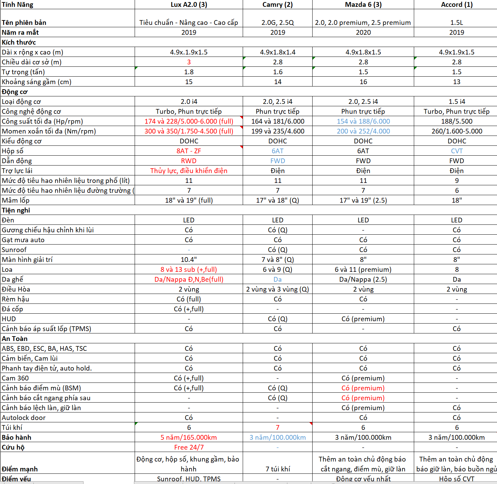

# VF Sale policies in HCM 2021 - Vietnamese version

Thực hiện khảo sát khoa học đề tài: “Phân tích các yếu tố ảnh hưởng đến quyết định làm nhân viên kinh doanh ô tô VF tại TP.HCM 2021”.

# :briefcase: 1. Đặt vấn đề
Mục tiêu: 
- Yếu tố nào ảnh hưởng đến quyết định làm nhân viên kinh doanh.
- Thực trạng các yếu tố so với mặt bằng chung.

Thời gian: quý 4 năm 2021

Phương pháp: Định tính (nghiên cứu lý thuyết, tài liệu) kết hợp định lượng (đo lường thông qua khảo sát).
# :books: 2. Chuẩn bị dữ liệu
Theo nhiều nghiên cứu, các yếu tố ảnh hưởng đến quyết định làm việc của nhân viên bao gồm: Lương, thưởng, chế độ làm việc, đào tạo, văn hóa công ty, tầm nhìn sứ mệnh. Ngoài ra, với nhiều năm kinh nghiệm trong lĩnh vực này, tôi đề xuất yếu tố bổ sung là khả năng cạnh tranh của sản phẩm.

- Dữ liệu sơ cấp thu thập từ kết quả khảo sát.

  [Form khảo sát](https://docs.google.com/forms/d/e/1FAIpQLSfEiDt4blafsnS0-OI65lrqMBET7rwqhSP-A8PKuoJ5pdew1Q/viewform?usp=sf_link)

  Khảo sát được gửi qua email cá nhân của các sale person các hãng, thực hiện khảo sát 150 chuyên viên bán hàng, của 6 thương hiệu xe hơi phổ thông cạnh tranh trực tiếp với VinFast là: Toyota, Kia, Mazda, Ford, Mitsubishi, Honda, Huyndai và VinFast. Thu nhập 120 bảng kết quả.

  Kết quả khảo sát: 

 

- Dữ liệu thứ cấp từ nguồn tạp chí xe hơi chính thống và báo cáo Hiệp hội các nhà sản xuất xe hơi Việt Nam (VAMA)

  [Doanh số 2021- VAMA](http://vama.org.vn/Data/upload/files/2021/Thang12-2021/VAMA%20sales%20report%20December%202021%20-%20Detail.pdf)

# 📊 3. Xử lý dữ liệu
- Làm sạch dữ liệu sơ cấp gồm: Xóa bỏ những dữ liệu sai, dữ liệu trùng lặp, dữ liệu trống, tùy chỉnh định dạng dữ liệu. Mã hóa bảng câu hỏi, bảng câu trả lời, dùng SPSS để phân tích độ tin cậy của bộ dữ liệu khảo sát.

# 🔎 4. Phân tích thực trạng các yếu tố ảnh hưởng đến quyết định làm việc
## 4.1. Lương, thưởng
|VinFast|Toyota|Kia|Mazda|Ford|Mitsubishi|Honda|Huyndai
|:-----|:-----|:----|:----|:----|:----|:------|:----|
|7.5 tr|3.5 tr|7 tr|7 tr|3.5 tr|3.5 tr|3.5 tr|3.5 tr|

Lương: Đối với hình thức hợp tác thương hiệu ký độc quyền sản xuất, phân phối (THACO) hay ký hợp đồng đại lý phân phối với nhiều công ty. Do đó, bậc lương của nhân viên kinh doanh mới sẽ khác nhau, loại hợp đồng chính thức thường là 7 triệu đồng, nếu là loại hợp đồng công tác sẽ chỉ trên mức lương tối thiểu vùng là 3.5 triệu đồng.

Thưởng: Tùy thuộc vào năng lực và kết quả kinh doanh, doanh thu cá nhân, phòng, đại lý hay loại xe bán được. Thưởng có yếu tố tác động lớn hơn Lương trong việc đưa ra quyết định nhận việc.

|VinFast Fadil|VinFast Lux A|VinFast Lux SA|VinFast VF e34|
|:-----|:-----|:----|:----|
|3.5 tr|9.1 tr|15 tr|N/A|

Chính sách thưởng của VinFast quý 4/2021 cao nhất trong tất cả thương hiệu phổ thông.
## 4.2. Chế độ phúc lợi, làm việc

Chế độ phúc lợi: tương đối như nhau:

|Brand|VinFast|Toyota|Kia|Mazda|Ford|Mitsubishi|Honda|Huyndai
|:----|:-----|:-----|:----|:----|:----|:----|:------|:----|
|BHYT, BHXH|Có|Có|Có|Có|Có|Có|Có|
Du lịch/ YEP|Có|Có|Có|Có|Có|Có|Có|
Đào tạo|Có|Có|Có|Có|Có|Có|Có|

Chế độ làm việc: 

|Brand|VinFast|Hãng khác|
|:----|:-----|:-----|
|Giờ làm việc|8:30-17:30|8:00-17:00 or 9:00-18:00|
|Showroom|Trong TTTM Vincom hoặc 3S Độc lập| 1S, 3S Độc lập
|Trực Showroom|Theo giờ hoạt động của TTTM Vincom 8:30 - 15:00 or 15:00 - 22:00. 3S Độc lập: 8:00 - 18:00| 8:00 - 19:000
|Sơ đồ quản lý|Quản lý miền > Quản lý chi nhánh + Quản lý Camera| Miền > Chi Nhánh or Công ty > Đại lý trực tiếp

Showroom VF hoạt động theo showroom trong TTTM nên thời gian làm việc, trực bán hàng có sự khác biệt. Ngoài ra, VinFast đã đi đầu trong việc áp dụng công nghệ giám sát qua Camera nên chất lượng dịch vụ tại Showroom được nâng cao mà hệ thống quản lý không cồng kềnh, tối ưu chi phí.

## 4.3. Tầm nhìn sứ mệnh
Tầm nhìn: Trở thành thương hiệu xe điện thông minh thúc đẩy mạnh mẽ cuộc cách mạng xe điện toàn cầu.

Sứ mệnh: Vì một tương lai xanh cho mọi người

Giá trị cốt lõi: Sản phẩm đẳng cấp, giá tốt, hậu mãi vượt trội.

Triết lý thương hiệu: Đặt khách hàng làm trọng tâm, VinFast không ngừng sáng tạo để tạo ra các sản phẩm đẳng cấp và trải nghiệm xuất sắc cho mọi người.

      Là thương hiệu xe hơi ô tô đầu tiên của Việt Nam, mang trong mình hồn Việt, trở thành một cá nhân trên con đường vươn ra biển lớn của VF là một điều hết sức tuyệt vời, so với phần còn lại.
## 4.4. Khả năng cạnh tranh của sản phẩm
Fadil vs phân khúc A:

- So sánh trang bị từ brochure:

   

  Fadil nổi trội hơn ở Động Cơ 1.4L, 98 Hp. Xe có hệ thống âm thanh 6 loa, hộp số vô cấp CVT. Tính năng an toàn đầy đủ. Hệ sinh thái Vingroup 

- Bản đồ giá

   

  Fadil không có sự chênh lệch giá bán, phiên bản cao cấp nhất các hãng đều khoảng 440 triệu

- Doanh số bán hàng:

  

  Fadil có doanh số cao nhất năm 2021, chiếm 72.25% với 24.128 xe được bán ra.

Lux A vs sedan hạng D:

- So sánh trang bị từ brochure:

  

  Lux A trang bị động cơ từ 174 đến 228 Hp mạnh mẽ nhất. Hộp số 8 cấp từ nhà sản xuất nổi tiếng ZF. Với trực cơ sở 3 mét, dài nhất mang lại không gian bên trong rộng rãi. Hệ thống dẫn động RWD mang đến cảm giác lái thể thao và hệ thống treo khí nén êm ái. Bảo hành đến 5 năm / 165.000km và được hưởng hệ sinh thái nhiều ngành nghề của VinGroup.

- Bản đồ giá

  

  VF Lux A, giá ngang với Mazda 6, thấp hơn Camry và Accord 200 triệu, nhưng có thể áp dụng voucher giảm thêm 200 triệu từ việc mua căn hộ Vinhome.

- Doanh số bán hàng:

  

  Lux A có doanh số cao nhất năm 2021, chiếm 53.31% với 6.330 xe được bán ra.

Lux SA vs SUV:
- So sánh trang bị từ brochure:

  

  Lux SA có điểm mạnh từ động cơ, hộp số, hệ thống treo, hệ thống khung gầm nguyên khối chắc chắn, hệ dẫn động cầu sau thể thao, chính sách bảo hành 5 năm và hệ sinh thái VinGroup.

- Bản đồ giá

  

  Lux SA có giá bán cạnh tranh như nhau và có thể áp dụng voucher giảm thêm 200 triệu từ việc mua căn hộ Vinhome.

- Doanh số bán hàng:

  

  Lux SA có doanh số thuộc nhóm cao nhất năm 2021, chiếm 13.3% với 5.180 xe được bán ra.

Từ dữ liệu khảo sát:

  

  VinFast Saler cho rằng hơn 50% cho rằng top 1 xe chạy nhất là Fadil, top 2  Lux A và top 3 hoặc là VF e34 hoặc là VF Lux SA, điều này tương đồng với báo cáo doanh số của VinFast.

Ngoài ra 70% đồng ý rằng trong năm 2022 sẽ tung ra hơn sản phẩm xe điện chủ lực là VF 8 và VF 9. Đó là một cú hích rất lớn trên thị trường và là cơ hội cho những saler mới gia nhập VF, có thể đứng trên ngọn sóng, nắm được cơ hội lớn từ nhu cầu thị trường.

# ✔ 5. Kết luận và kiến nghị

Kết luận: Từ năng lực cạnh tranh rất lớn của những dòng sản phẩm chủ lực Fadil, Lux A và Lux SA và sự kiện ra mắt 2 dòng xe điện đầu tiên của Việt Nam VF 8 và VF 9, kết hợp với yếu tố lương, thưởng dẫn đầu ngành, có thể kết luận rằng chính sách dành cho nhân viên kinh doanh của VinFast hết sức tiềm năng, là cơ hội lớn cho mọi ứng viên đón đầu.

Hạn chế & Kiến nghị: 
- Chưa đo lường được mối tương quan, hệ số tác động từ biến độc lập (lương thương, phúc lợi, sức cạnh tranh) dẫn đến quyết định làm việc
- Cần chỉnh sửa bảng câu hỏi khảo sát bổ sung biến quan sát.

